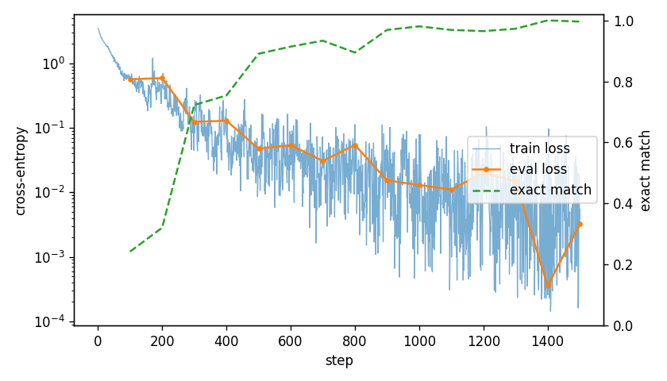

# Transformer from Scratch

An encoder-decoder Transformer ("Attention Is All You Need") written from first
principles in NumPy, trained by a small reverse-mode **automatic differentiation
engine** I wrote for it. No deep learning framework is used for the model or the
training. PyTorch appears only in the test suite, as a reference to check my
gradients against.



*Reversing sequences of 3–10 symbols: held-out exact-match accuracy reaches
**99.6%** after 1,500 steps (170k parameters, CPU only, about 6 minutes).*

## What's inside

```
scratchformer/
  engine.py      Tensor + reverse-mode autodiff (broadcasting, matmul, reductions, indexing, ...)
  functional.py  softmax / log-softmax with fused backward, dropout, cross-entropy
  nn.py          Module system, Linear, Embedding, LayerNorm, Dropout
  attention.py   sinusoidal positional encoding, multi-head attention, masks
  model.py       encoder / decoder layers, full Transformer, greedy decoding
  optim.py       SGD, Adam(W), Noam warmup schedule, gradient clipping
  data.py        synthetic copy / reverse / sort seq2seq tasks
  gradcheck.py   finite-difference gradient checker
train.py         training loop with evaluation, checkpointing and loss plots
tests/           gradient checks, PyTorch cross-checks, convergence test
```

### Autodiff engine

Each `Tensor` op records its parents and a closure that maps the output gradient
to its inputs' gradients. `backward()` builds a topological order with an
iterative DFS (so deep graphs don't hit Python's recursion limit) and runs the
closures in reverse. Notes on the details:

- **Broadcasting**: gradients are summed back down to each operand's shape.
- **Batched matmul**: works for N-d operands and 1-d vectors.
- **Indexing**: `np.add.at` scatters gradients, so repeated indices such as a
  token that appears twice in an embedding lookup accumulate correctly.
- **Fused softmax / log-softmax**: hand-derived Jacobian-vector products, stable
  for large logits.
- `no_grad()` turns off graph construction for inference.

### Model

| Component | Implementation |
|---|---|
| Multi-head attention | `softmax(QKᵀ/√d_k)V` over `h` heads at once, by reshaping to `(B, h, T, d_k)` |
| Positional encoding | fixed sinusoidal table, `sin`/`cos` at geometric frequencies |
| Layer normalization | built from engine primitives, so its backward pass comes from autodiff |
| Masks | key padding mask plus a causal mask for decoder self-attention |
| Residuals | pre-norm `x + Sublayer(LN(x))` with a final LN per stack |
| Training | Adam (β₂ = 0.98), Noam warmup schedule, grad clipping, label smoothing (optional) |

## Verifying correctness

```bash
pip install -r requirements.txt
pytest -q
```

55 tests, about 5 seconds in total:

- **Per-op gradient checks** (`tests/test_engine.py`): every op is compared with
  central finite differences in float64, including broadcast, batched-matmul and
  repeated-index cases.
- **Layer and model gradient checks** (`tests/test_layers.py`): Linear,
  LayerNorm, masked multi-head attention, encoder/decoder layers, and the
  cross-entropy loss of the full Transformer with respect to every parameter.
- **PyTorch cross-checks** (`tests/test_against_torch.py`): forward values and
  gradients for LayerNorm, cross-entropy (with padding and label smoothing),
  multi-head attention, and composite expressions match `torch.autograd` to
  about 1e-9.
- **Behaviour tests**: masked positions get zero attention, padding leaves the
  predictions unchanged, and the decoder is causal.
- **Convergence** (`tests/test_training.py`): a small model learns the copy task
  to over 90% exact match in 250 steps.

## Training

```bash
python train.py --task reverse --steps 1500 --plot
python train.py --task sort --steps 3000
python train.py --task copy --steps 500 --layers 1
```

```
step   100 | train loss 0.6215 | eval loss 0.5678 | token acc 0.780 | exact match 0.242
step   500 | train loss 0.0204 | eval loss 0.0476 | token acc 0.984 | exact match 0.891
step  1000 | train loss 0.0795 | eval loss 0.0130 | token acc 0.997 | exact match 0.980
step  1500 | train loss 0.0055 | eval loss 0.0032 | token acc 0.999 | exact match 0.996

sample predictions (held-out):
  [8, 10, 12, 3, 4, 11] -> [11, 4, 3, 12, 10, 8]
  [5, 6, 11, 7, 5, 11, 5, 7, 9, 8] -> [8, 9, 7, 5, 11, 5, 7, 11, 6, 5]
```

Each run writes the checkpoint (`model.npz`), the metric history and an optional
loss plot to `runs/latest/`. Run `python train.py -h` to see all options.

## References

- Vaswani et al., *Attention Is All You Need*, 2017
- Xiong et al., *On Layer Normalization in the Transformer Architecture*, 2020 (pre-norm)
